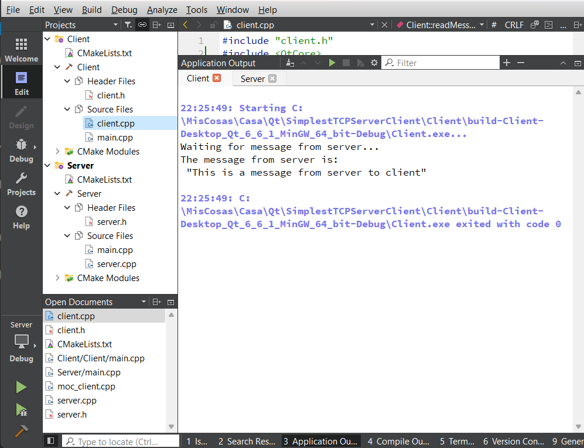
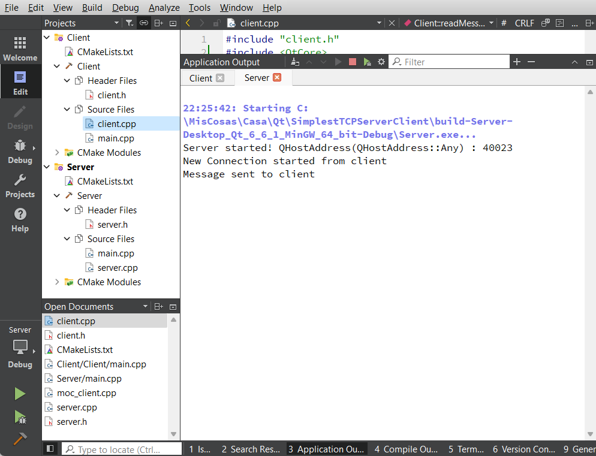

# Simple Server/Client Example using QTcpServer with Qt C++

This example works like this:
  - Server: Is listening on port 40023 for client connections. When a client connects sends a message a close the connection for that client. Then waits for next client connection.
  - Client: Just connect to server by default on IP 192.168.0.101 and port 40023. Then receives a message from the server and finally quits. 
 
this is a screenshot of the server:



this is a screenshot of the server:



## Getting Started

It's interesting you start with Qt Local Fortune Server and Client Examples: 
 - https://doc.qt.io/qt-6/qtnetwork-fortuneserver-example.html
 - https://doc.qt.io/qt-6/qtnetwork-fortuneclient-example.html

### Prerequisites

You need a working environment with:
* [Git](https://git-scm.com) - You can install it from https://git-scm.com/downloads.
* [Qt](https://www.qt.io/download-open-source) - Install the community version.

## General Installation instructions

The best option to start with this project is cloning it in your PC:

```
git clone https://github.com/tcrurav/QtSimplestTCPServerClient.git
```

Open and run the project from the Qt Creator.

Enjoy!!!

## Built With

* [Qt Creator](https://www.qt.io/download-open-source) - Install the community version.

## Acknowledgments

* https://doc.qt.io/qt-6/qtnetwork-fortuneserver-example.html. The fortune Server Example.
* https://doc.qt.io/qt-6/qtnetwork-fortuneclient-example.html. The fortune Client Example.
* https://www.bogotobogo.com/cplusplus/sockets_server_client_QT.php. SOCKETS - SERVER & CLIENT USING QT.
* https://www.w3schools.com/cpp/. An introduction to C++.
* https://github.com/PurpleBooth/a-good-readme-template. A good README.md template.